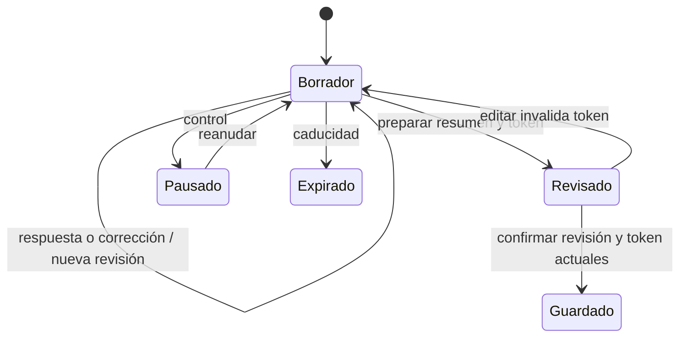

# Open2Connect — Spec Driven Development

Versión 1, 2026-09-12. Base de implementación: `d584c14`. Contexto e historial: [index.md](index.md). Ejecución: [agents.md](agents.md). Método: [skills.md](skills.md).

## 1. Objetivo y alcance

Permitir que asistentes a un evento declaren qué necesitan y ofrecen, encuentren personas con coincidencias explicables y acuerden compartir contacto. La experiencia presencial añade identificación del participante, seña voluntaria, llegada y seguimiento de encuentros.

Actores: participante registrado en la web, participante con enlace personal, operador del dispositivo presencial y agente MCP con token delegado. Los tres mecanismos de acceso son distintos y no deben tratarse como equivalentes.

Fuera del alcance aprobado: migración completa a React, chat persistente, proximidad Bluetooth real, conversión a Supabase Auth, migración automática de datos locales y reescritura del kiosco pospuesta por el usuario. La aspiración de conversación natural no implica reproducir todas las capacidades del producto ChatGPT.

## 2. Convenciones de estado

- **Implementado**: existe código; no implica prueba real del proveedor ni aprobación para producción.
- **Brecha**: la base actual no satisface un contrato o tiene evidencia contradictoria.
- **Propuesto**: requiere una decisión y trabajo posterior.
- Los criterios siguientes definen aceptación; no equivalen a resultados de pruebas ejecutadas en esta tarea.

## 3. Requisitos y aceptación

| ID | Requisito | Estado y criterio de aceptación |
| --- | --- | --- |
| FR-01 | Registro y sesión propia | Implementado. Dadas credenciales válidas, obtener sesión; credenciales inválidas no dan acceso; otro usuario no puede leer el borrador propio. |
| FR-02 | Perfil general y por evento | Implementado mediante repositorio. Guardar en evento A no cambia los campos específicos de B; el perfil general pertenece al mismo usuario. |
| FR-03 | Ausencia de necesidades/ofertas | Implementado. Al declarar `none`, limpiar los campos correspondientes; no exigir información inexistente. |
| FR-04 | Entrevista con evidencia y revisión | Implementado en módulo heredado. Una nota sin evidencia válida se rechaza; editar invalida la revisión previa; solo confirmar la revisión actual guarda el perfil. |
| FR-05 | Voz natural de entrevista web | Brecha. Adaptador presente, ruta `/api/interviews/voice` ausente, transporte esperado por tests incompatible con el archivo actual. La pestaña está oculta. Decidir conservar o retirar antes de reconciliar contratos. |
| FR-06 | Perfil remoto explícito | Implementado en adaptadores. Fallo remoto produce error sin fallback silencioso; general/evento se guardan atómicamente. Kiosco y `/yo` todavía usan SQLite directo. |
| FR-07 | Recomendaciones web explicables | Implementado por reglas. Excluir propio usuario y aplicar filtros de evento, visibilidad, bloqueos y disponibilidad/idioma según módulo; dar razones basadas en términos declarados. |
| FR-08 | Invitaciones y contacto | Implementado en web. Contacto solo después de aceptación y permiso de compartir; rechazo no concede contacto. |
| FR-09 | MCP acotado | Implementado. Token delegado limita usuario/evento y operaciones; caducidad o revocación deniega acceso. No permite la ruta de conexión de voz. |
| FR-10 | Conversación presencial | Implementado en `/agent` y `/kiosk`, pendiente validación de audio real en esta base. Buscar/desambiguar, confirmar datos, registrar llegada y explicar sugerencias. |
| FR-11 | Seña mediante foto voluntaria | Implementado. Solicitar permiso, capturar imagen, obtener ropa/accesorios, confirmar/corregir; ante negativa o fallo usar descripción verbal. No persistir ni registrar imagen en la aplicación. Validación real pendiente. |
| FR-12 | Página personal y llegada | Implementado en `/yo/<id>`, con consulta periódica. Mostrar coincidencias y transición de llegada sin escribir sugerencias en cada consulta. Acceso por ID sin sesión: brecha de autorización a revisar. |
| FR-13 | Confirmar encuentro | Implementado con par ordenado y clave por evento. Repetir confirmación no duplica la fila local; los efectos externos no tienen garantía equivalente de idempotencia. |
| FR-14 | Operación y despliegue | Blueprint y ping implementados. Un healthcheck solo demuestra respuesta del servidor; persistencia, autorización y proveedores requieren comprobación independiente. |

## 4. Contratos de datos

Perfil general: `name`, `role`, `experience`, `sector`, `interests`, `languages`.

Perfil de evento: `needs_status`, `offers_status`, `purpose`, `problem`, `help`, `priority`, `outcome`, `skills`, `knowledge`, `services`, `resources`, `availability`, `contact`, `share_contact`; además `visible` controla publicación. El validador de `profiles.py` es la fuente exacta de tipos, límites y obligatoriedad.

`needs_status=none` limpia `problem`, `help`, `priority`, `outcome`; `offers_status=none` limpia `skills`, `knowledge`, `services`, `resources`. La disponibilidad admite `available`, `limited`, `unavailable`.

Repositorio de perfiles:

```text
get(user_id, event) -> perfil combinado + visible + saved
save(user_id, event, general, data, visible) -> escritura atómica
participants(event) -> filas compatibles con matching y las identidades locales
```

Borrador de entrevista: propietario/evento, modo, revisión, notas con evidencia, pregunta y estado de control. Es transitorio, con caducidad de dos horas; perder el proceso pierde borradores. El identificador de turno permite deduplicación. La confirmación exige consentimiento explícito y token de revisión vigente.

`checkins`: clave actual `user_id`, con `event_id`, hora y seña. No soporta múltiples filas de check-in por usuario/evento. `encuentros`: clave compuesta por par de usuarios ordenado y evento, más hora. No confundir un encuentro marcado por una persona con aceptación bilateral de contacto.

## 5. API y superficies

Todas las rutas se definen en `backend/server.py`. Los POST JSON requieren las validaciones de contenido y encabezado `X-Open2Connect: 1`; la comprobación de origen se aplica cuando existe `Origin`. Estos controles no sustituyen autorización.

| Superficie | Operaciones | Acceso actual |
| --- | --- | --- |
| `/api/health`, `/api/config` | GET | Público; configuración sin secretos |
| `/api/register`, `/api/login` | POST | Público con limitación de intentos |
| `/api/me`, `/api/profile`, `/api/events` | GET; perfil también POST | Sesión, o alcance MCP donde se permita |
| `/api/logout` | POST | Sesión |
| `/api/interviews/start`, `/turn`, `/edit`, `/summary`, `/confirm`, `/control` | POST bajo `/api/interviews/` | Propietario de la entrevista; token MCP en operaciones permitidas |
| `/api/interviews/draft?id=…` | GET | Propietario |
| `/api/interviews/voice` | No despachada en esta base | Brecha respecto a tests/adaptador |
| `/api/mcp/token`, `/api/mcp/revoke` | POST | Gestión del token del participante |
| `/api/kiosk/token`, `/buscar`, `/confirmar`, `/checkin`, `/recomendar`, `/qr`, `/apariencia` | POST bajo `/api/kiosk/` | `X-Kiosk-Key` si está configurada; sin sesión |
| `/api/yo/estado?id=…` | GET | ID suministrado; sin sesión |
| `/api/yo/confirmar` | POST con `id`, `otro` | IDs suministrados; sin sesión |
| `/`, `/agent`, `/kiosk`, `/yo/<id>` | GET HTML | Público |

Límite HTTP habitual: 40.000 bytes; `/api/kiosk/apariencia` admite 2.000.000 y aplica además validación de imagen en su módulo. Los errores del dominio pueden producir 400/401/403/404/409/413/429/502/503 según el caso; algunas rutas nuevas retornan objetos `error` con HTTP 200. No uniformar estos contratos solo en documentación.

## 6. Estados e invariantes



Este esquema corresponde a la entrevista heredada. El agente presencial realiza guardados incrementales con herramientas; no implementa este mismo estado de revisión.

Invariantes de diseño: no inventar hechos; no guardar borradores como perfiles confirmados; no aceptar identidad arbitraria en operaciones autenticadas; no publicar claves de servidor; no sustituir almacenamiento tras un fallo; no presentar puntuación de reglas como porcentaje científico; no inferir cercanía física a partir de llegada; no exponer contacto sin consentimiento.

Brechas explícitas: `/agent` y `/kiosk` insertan la clave de kiosco en HTML público; `/yo` usa el ID del participante como acceso y devuelve IDs de candidatos; sus operaciones ocurren antes de autenticar la sesión. Kiosco y `/yo` no comparten todos los filtros del matching web. Estas superficies necesitan su propia especificación de autorización y privacidad antes de considerarlas equivalentes al flujo autenticado.

## 7. Requisitos no funcionales

- Seguridad: contraseñas derivadas, cookies HttpOnly/SameSite, Secure con HTTPS, consultas parametrizadas y TLS `verify-full` para PostgreSQL. Las brechas anteriores impiden una afirmación global de seguridad de producción.
- Privacidad: secretos solo en servidor; borradores transitorios; fotografía sin persistencia local; no prometer retención cero del proveedor. El envío de nombres, perfil, email o imagen debe evaluarse por flujo, incluyendo integraciones opcionales.
- Recuperación: errores de proveedor visibles y recuperables; reintentos sin duplicar cambios. Validar por separado efectos externos de check-in/encuentros.
- Rendimiento: no hay SLO medido. `/yo` consulta cada diez segundos; medir concurrencia, SQLite y llamadas externas antes de establecer capacidad.
- Persistencia: respaldar identidad SQLite incluso con perfiles remotos; no usar ping como sustituto de almacenamiento durable.
- Accesibilidad: conservar alternativas existentes de texto y seña verbal; comprobar permisos y recuperación en navegador. No declarar cumplimiento formal sin auditoría.

## 8. Verificación y trazabilidad

| Requisitos | Código principal | Evidencia a ejecutar |
| --- | --- | --- |
| FR-01/02/03/07/08 | auth, profiles, matching, connections | `tests/test_app.py` y escenarios con dos usuarios |
| FR-04/09 | interviews, mcp_access, mcp_server | `tests/test_interview.py`, protocolo MCP y aislamiento |
| FR-05 | realtime_voice, server, frontend | `tests/test_realtime.py`, `tests/realtime.test.cjs`; reconciliar incompatibilidad actual |
| FR-06 | profile_store, postgres_profiles | `tests/test_postgres.py`, diagnóstico y transacciones en destino autorizado |
| FR-10/11/12/13 | kiosk, encuentros, agent, yo | Nuevos casos de autorización, consentimiento, deduplicación y navegador; no se identificó suite dedicada en esta base |
| FR-14 | render.yaml, keepalive.yml | Arranque limpio, persistencia tras reinicio y revisión del workflow |

La sesión previa registró 39 pruebas Python y 10 JavaScript aprobadas sobre correcciones locales que ya no están en este checkout. No es resultado de `d584c14`. Esta tarea documental no reejecuta suites ni verifica servicios externos.

## 9. Desarrollo dirigido por especificación

1. Crear una ficha de cambio con problema, alcance, requisito, escenario y estado.
2. Diseñar contrato completo: interfaz, API, autorización, persistencia, fallos y compatibilidad.
3. Preparar pruebas de aceptación proporcionales al impacto. No añadir pruebas triviales para cambios puramente documentales.
4. Implementar, verificar y resolver fallos dentro del alcance; registrar impedimentos reales.
5. Actualizar esta especificación, `index.md` y pasos operativos si cambian.
6. Publicar o migrar solo con autorización aplicable; preparar rollback y respaldo para cambios persistentes.

Plantilla de ficha:

```text
ID / estado / commit base:
Problema y resultado observable:
Requisitos afectados y exclusiones:
Contrato y migración (si aplica):
Dado / cuando / entonces:
Verificación ejecutada y resultado:
Riesgos, recuperación y pendientes:
```

Prioridad siguiente propuesta: reconciliar entrevista y tests con la decisión de producto; asegurar continuidad de datos; validar `/agent` con proveedores reales; diseñar acceso de `/yo` y operación presencial cuando se retome ese alcance. React, chat y Bluetooth siguen siendo propuestas sin implementación.
