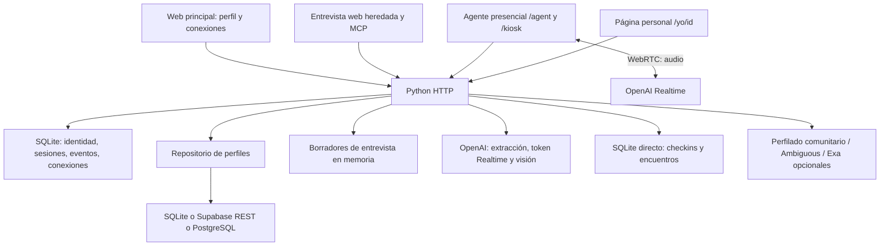

# Open2Connect — índice, historial y arquitectura

> **Actualización posterior: integración /agent + Supabase.** La petición actual reemplaza el alcance anterior: toda la app tiene una capa PostgreSQL preparada y `/agent` es la única pantalla de entrevista. El usuario decidió iniciar sin migrar datos. Se creó el esquema vacío `o2c_app` en Supabase y la instancia principal ya usa `DATABASE_PROVIDER=postgres`; los datos anteriores se conservan sin importar. Ver [estado, contratos y corte](docs/UNIFIED_DATABASE.md). Los apartados anteriores sobre SQLite obligatorio y kiosco pospuesto describen la base histórica.

Fecha de corte: 2026-09-12. Base inspeccionada: `d584c14`. Este documento conserva el historial técnico disponible de la conversación y de Git; no es una transcripción literal ni contiene credenciales. Los hechos de sesiones anteriores se distinguen del código actual.

## Documentos de entrada

| Documento | Propósito |
| --- | --- |
| [skills.md](skills.md) | Flujo de trabajo y selección de skills |
| [sdd.md](sdd.md) | Especificación, criterios de aceptación, brechas y evolución |
| [agents.md](agents.md) | Instrucciones para agentes y reconstrucción del entorno |
| [README.md](README.md) | Presentación y arranque original |
| [Entrevista](docs/INTERVIEW.md) | Diseño de entrevista, API y MCP |
| [Equipo](docs/TEAM_PLAN.md) | Distribución histórica del trabajo |
| [Demo](docs/DEMO.md) | Recorrido demostrativo |
| [Despliegue](docs/DEPLOYMENT.md) y [Render](docs/DEPLOY_RENDER.md) | Preparación de publicación |
| [Kiosco](docs/KIOSK.md) y [voz del agente](docs/REALTIME_FRONT.md) | Flujos presenciales |
| [Base comunitaria](db/README.md) | Datos comunitarios de ejemplo |

Los documentos anteriores pueden describir etapas previas. Ante discrepancias, revisar el código del commit indicado y registrar la decisión; no interpretar una intención documentada como funcionalidad validada.

## Producto y estado actual

Open2Connect conecta participantes de un evento según lo que necesitan y ofrecen, con explicaciones basadas en información declarada. La web principal permite registro, perfil, descubrimiento, invitaciones y notificaciones internas. El evento predeterminado es `medellin-2026`.

La actualización más reciente oculta la pestaña de entrevista web en la navegación. La experiencia de entrevista se orienta ahora al dispositivo del evento en `/agent`. Los módulos antiguos de entrevista y sus API siguen presentes. `/kiosk` es otra interfaz presencial. `/yo/<id>` es la página personal que muestra coincidencias, llegada y confirmación de encuentros.

El frontend es HTML, CSS y JavaScript sin compilación. No existe una aplicación React integrada. El backend usa Python y `ThreadingHTTPServer`. SQLite conserva identidad y operaciones locales incluso cuando los perfiles se guardan en Supabase.

## Historial de la sesión disponible

1. Se construyó un MVP bilingüe ES/EN con perfiles persistentes, extracción por reglas, recomendaciones explicables y conexiones con consentimiento.
2. Se publicó la base funcional en GitHub. Una rama local histórica de respaldo, `codex/local-before-publication-20260912`, contenía estado que no debía publicarse; no debe subirse sin revisión.
3. Se añadió una entrevista guiada con notas editables, correcciones, revisión y confirmación; después se incorporaron adaptadores opcionales OpenAI, Realtime y un puente MCP.
4. El usuario proporcionó el proyecto Supabase y datos de conexión. Las credenciales quedan excluidas de este historial. Se resolvieron problemas de conexión/TLS y se configuró acceso PostgreSQL con verificación del certificado.
5. Durante la sesión previa se aplicó la migración de perfiles al proyecto autorizado y se realizaron comprobaciones transaccionales con datos sintéticos y rollback. No se migraron automáticamente usuarios, sesiones ni perfiles locales existentes.
6. El usuario pidió abrir y ejecutar la aplicación, comprender la entrevista y acercarla a una interacción de voz natural. Se trabajó sobre el frontend existente y WebRTC.
7. Se incorporaron cambios del equipo: kiosco de voz, perfilado comunitario, integración opcional Ambiguous y configuración de Render.
8. El usuario pidió revisar cambios y corregir fallos que rompían la aplicación; posteriormente indicó posponer el tema del kiosco. Se corrigieron localmente rutas/configuración de voz y se separó el transporte de entrevista del transporte del kiosco.
9. En aquella versión local se registraron 39 pruebas Python y 10 JavaScript aprobadas, además de comprobaciones HTTP. El último arranque informado fue `python -m backend.local` en el puerto 8000. No hubo validación real de micrófono/OpenAI por falta de clave configurada en esa comprobación.
10. El usuario propuso un cliente React mediante un archivo adjunto. Se analizó: dependía de autenticación Supabase, WebSocket, chat y estructuras inexistentes, y contenía fragmentos incompletos. No se integró ni se aprobó una migración de framework.
11. Se solicitó esta documentación. Un primer índice quedó iniciado antes de la actualización del repositorio; ya no estaba presente al inspeccionar el nuevo checkout.
12. El usuario actualizó el repositorio y reiteró la creación de los cuatro documentos. La nueva base añade fotografía para la seña, página `/yo`, confirmación de encuentros y un workflow de ping a Render; oculta la entrevista web.
13. En `d584c14` no están las correcciones locales anteriores: falta `frontend/interview-realtime.js`, el despacho HTTP no incluye `interviews/voice` y `/api/config` no incluye la sección Realtime. Las pruebas antiguas de transporte siguen apuntando a `frontend/realtime.js`, que actualmente implementa el kiosco. Los resultados del paso 9 no validan este checkout.

## Historial visible en Git

| Commit | Cambio |
| --- | --- |
| `9be59d7` | Archivo inicial de Juan |
| `560cdf1` | Archivo inicial de Luis |
| `f103230` | Archivo inicial de Jacobo |
| `179d426` | MVP interactivo y conexiones con consentimiento |
| `289fa7b` | Entrevista |
| `0fe5acc` | Agente de check-in Realtime, perfilado y Ambiguous |
| `41314cb` | Perfilado en segundo plano al guardar perfil |
| `6205546` | Blueprint y guía Render |
| `78638b9` | Consolidación de cambios locales |
| `ba694dd` | Seña mediante fotografía, `/yo` y encuentros |
| `393b20f` | Workflow keepalive |
| `d584c14` | Entrevista web oculta; experiencia en `/agent` |

## Arquitectura

### Responsabilidades

| Código | Responsabilidad |
| --- | --- |
| `backend/server.py` | Rutas HTTP, contenido estático, cookies, validación de solicitudes |
| `backend/local.py` | Carga literal de `.env` y arranque local |
| `backend/db.py` | SQLite, esquema base e inicialización |
| `backend/modules/auth.py` | Registro, contraseñas y sesiones |
| `backend/modules/profiles.py` | Validación y separación perfil general/evento |
| `backend/adapters/profile_store.py` | Selección explícita SQLite/Supabase/PostgreSQL |
| `backend/adapters/postgres_profiles.py` | Consultas parametrizadas y TLS verificado |
| `backend/modules/interviews.py` | Borradores, evidencia, revisión, confirmación y control |
| `backend/adapters/interview_ai.py` | Extracción estructurada mediante Responses |
| `backend/adapters/realtime_voice.py` | Adaptador SDP de entrevista; actualmente sin ruta HTTP de voz |
| `backend/mcp_server.py`, `backend/modules/mcp_access.py` | Puente MCP y alcance por participante/evento |
| `backend/modules/matching.py`, `connections.py` | Recomendaciones y conexiones de la web |
| `backend/modules/kiosk.py` | Búsqueda, actualización, check-in, visión y token de voz |
| `backend/modules/encuentros.py` | Coincidencias personales y confirmación de encuentro |
| `backend/modules/perfilador.py`, `ambiguous.py`, `enriquecedor.py` | Integraciones opcionales |
| `frontend/app.js`, `interview.js`, `speech.js` | Aplicación principal y entrevista heredada |
| `frontend/agent.js`, `realtime.js`, `kiosk.js` | Voz y herramientas presenciales |
| `frontend/yo.js` | Consulta periódica y avisos de llegada en la página personal |

### Datos y límites

- SQLite: `users`, `sessions`, `events`, `profiles`, `invitations`, `blocks`, `notifications`, `mcp_tokens`; kiosco y encuentros crean además `checkins` y `encuentros` al importar sus módulos.
- Supabase: `o2c_general_profiles`, `o2c_event_profiles` y función `o2c_save_profile`, definidos en [la migración](supabase/migrations/202609120001_profiles.sql). Son perfiles vinculados a identidades locales.
- El esquema comunitario y sus 40 perfiles ficticios constituyen otra fuente de información; no sustituyen el registro de participantes. Su existencia remota no se verificó en esta actualización.
- Cambiar `PROFILE_STORE` no migra datos. Los módulos `kiosk.py` y `encuentros.py` consultan SQLite directamente y pueden divergir de los perfiles remotos.
- Las políticas RLS y permisos restringen acceso directo cliente; la identidad se verifica en la aplicación. No atribuir aislamiento mediante `auth.uid()` a operaciones administrativas/service role.
- La aplicación no persiste audio de entrevista. La fotografía para la seña se envía al proveedor y se procesa en memoria; esto no acredita ausencia de retención del proveedor.
- El flujo de entrevista heredado conserva borradores transitorios y exige confirmación de la revisión. El kiosco tiene un flujo distinto que guarda cambios incrementales: no hereda automáticamente esas garantías.
- Las recomendaciones de la web y las de kiosco/`yo` son implementaciones distintas. No afirmar que comparten todos los filtros de visibilidad, bloqueo, idioma o disponibilidad.

### Servicios y modelos configurados en código

Proyecto Supabase usado en la sesión: `https://yjloegnuyjziagppvdif.supabase.co`. El acceso directo usa el pooler y una CA pública incluida en [supabase/certs](supabase/certs/README.md); la contraseña no pertenece al repositorio.

La extracción de entrevista usa `OPENAI_MODEL`; su voz usa `OPENAI_REALTIME_MODEL` (valor predeterminado en código: `gpt-realtime-2.1`). El kiosco usa `REALTIME_MODEL` (`gpt-realtime`), `REALTIME_VOICE` (`marin`) y `REALTIME_VAD`. La nueva visión usa `VISION_MODEL` (`gpt-4o-mini`). Son valores encontrados en el código, no certificación de disponibilidad actual del proveedor.

`render.yaml` define un despliegue Python y `.github/workflows/keepalive.yml` solicita un ping cada cinco minutos a `https://open2connect.onrender.com/api/health`. El workflow tolera errores con `|| true`; no demuestra disponibilidad ni ejecución puntual. Esta tarea no verificó un despliegue remoto.

## Evidencia y pendientes

La generación de estos documentos inspeccionó Git, módulos, rutas, configuración, tests y documentación. No ejecutó una nueva batería funcional ni operaciones externas. Los resultados históricos no se trasladan automáticamente a `d584c14`.

Pendientes: reconciliar los tests y el transporte de entrevista heredado con la decisión de producto; validar voz/cámara reales; resolver coherencia de perfiles remotos con kiosco/`yo`; definir autorización de `/yo` y del dispositivo presencial; asegurar persistencia de SQLite en despliegue. El kiosco sigue fuera del alcance de corrección solicitado previamente; documentar sus cambios nuevos no implica autorizar una reescritura.

Registrar aquí cada cambio futuro con fecha, commit, petición, decisión, evidencia y pendientes, sin copiar datos personales ni secretos.

## Actualización local: acceso a entrevistas

Por petición del usuario, se añadió «Entrevista» al menú principal y un acceso desde registro/inicio de sesión. Ambos abren `/agent`; la cabecera del agente permite volver a `/`. Se conserva la entrevista web heredada oculta y no se cambian sus contratos ni el funcionamiento de voz del kiosco.

## Integración posterior solicitada por el usuario

Se preparó almacenamiento integral en `o2c_app`, migración transaccional con backup, acceso de entrevista limitado al propietario, consentimiento visible y matching compartido. Se retiró el cliente web heredado del bundle principal. La aplicación no se ha cambiado aún al nuevo proveedor: la revisión automática bloqueó la ejecución remota hasta aprobar expresamente la copia de cuentas/sesiones y datos. Ver `docs/UNIFIED_DATABASE.md`.

## Corte a Supabase sin importar datos

El usuario descartó migrar los registros anteriores. Se creó `o2c_app` vacío mediante `backend.setup_database`, se verificó el recorrido principal con datos sintéticos y rollback (cero registros de prueba restantes), y se reinició `/` y `/agent` en el puerto 8000 sobre PostgreSQL. SQLite y las tablas cloud anteriores quedan conservadas fuera del flujo activo. Las cuentas antiguas no se copiaron; es necesario registrarse de nuevo. La voz sigue pendiente de `OPENAI_API_KEY`.

## Diseño unificado de /agent

Se reutiliza `frontend/styles.css` para la tipografía, colores, menú y tarjetas de la app. `/agent` añade una tarjeta de voz, transcripción con estado vacío, instrucciones y recomendaciones. Se conserva el SVG animado y todos los IDs de los controles existentes. Verificación: controles presentes sin IDs duplicados, diff sin errores y revisión visual en navegador; no se cambiaron las API ni la base de datos.
